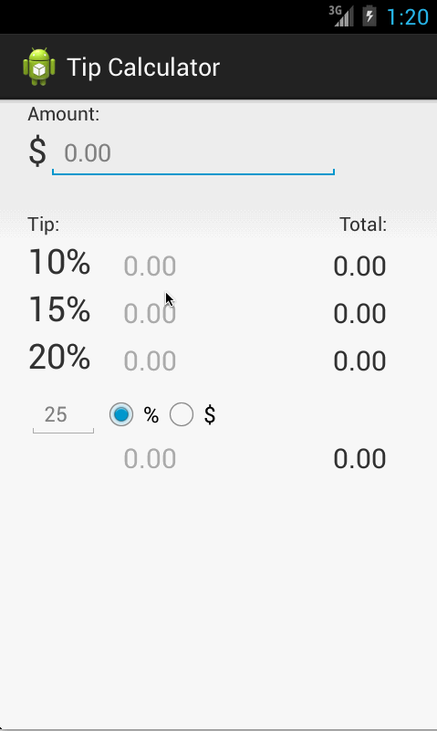

TipCalculator
=============
Time ~3 hours

Optional stories
  (Optional) User changes the total amount and updated tip is reflected automatically
  (Optional) User can select custom tip percentage if desired
  (Optional) Experiment with trying input widgets to replace the buttons and/or textviews
  
  User can also enter the tip amount in $ and see it reflect as a tip %. Useful when you want to tip cash which has fixed denominations.
  

